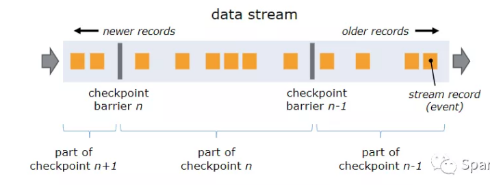

#### CheckPoint简介
+ Flink的一种容错机制，可恢复流应用程序的状态
+ 持续地制作分布式流数据流的快照，存储在(master结点或者HDFS)
+ 具体情况:如果程序出现故障，Flink将停止分布式数据流。然后，系统重新启动操作算子并将其重置为最新的成功的checkpoint

> 与Flink连接的Source要支持回滚才能使得CheckPoint机制完整(`Kafka`) 

#### 核心
+ 制作分布式数据流和操作算子状态的一致性快照
+ Flink的`checkpoint`是通过分布式快照实现的，因此快照和checkpoint的概念可以互换使用。

#### Barriers
+ barriers被注入数据流并与记录一起作为数据流的一部分向下流动
+ barriers将数据流中的记录分为进入当前快照的记录和进入下一个快照的记录
+ 每个barriers都带有快照的ID，并且barriers之前的记录都进入了该快照
+ 来自不同快照的多个barriers可以同时在流中出现，可以同时发生各种快照

+ 在向下游的过程中，遇到了操作算子:
    + 一个中间操作算子从其所有输入流中收到快照n的barriers时
    + 它会为快照n发出barriers进入其所有输出流中
    + 一旦sink操作算子（流式DAG的末端）从其所有输入流接收到barriers n，它就向checkpoint协调器确认快照n完成
    + 在所有sink确认快照后，意味快照着已完成

#### State
+ 当运算符包含任何形式的状态时，此状态也必须是快照的一部分.
+ 操作算子在他们从输入流接收到所有快照barriers时，以及在向其输出流发出barriers之前，会对其状态进行`写快照`
+ 此时，在 barrier 之前的数据对状态的更新已经完成，barrier 之后的数据不会更新状态
> 默认情况下，快照是存储到JobManager的内存，但对于生产使用，应配置分布式可靠存储（例如HDFS）
+ 在存储状态之后，操作算子确认checkpoint完成，将快照barriers发送到输出流中，然后继续。