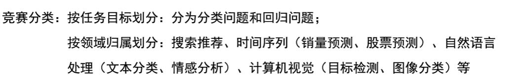
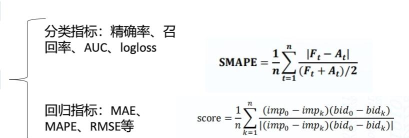
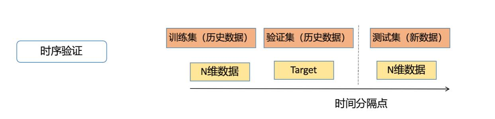
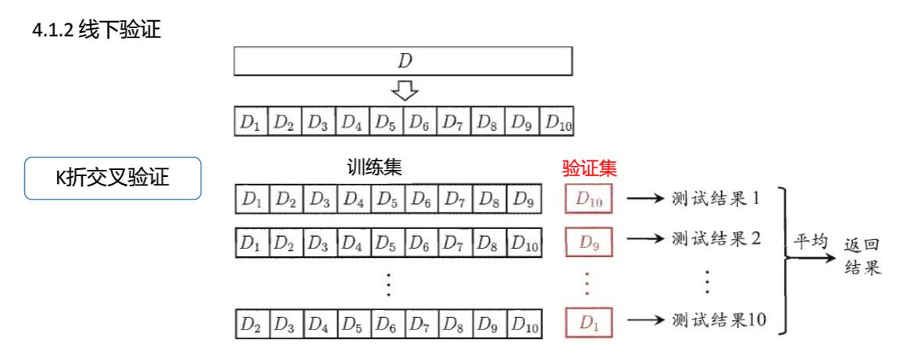
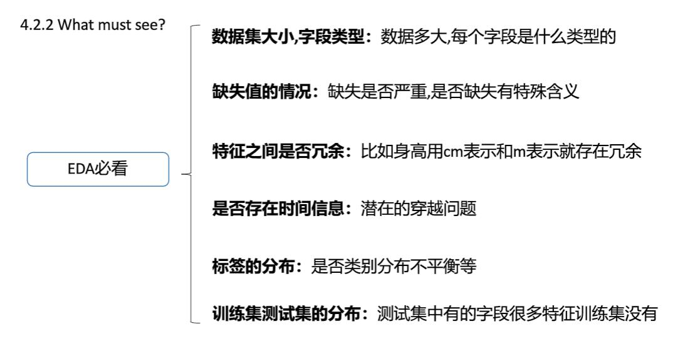

#### 特征缺失值的处理
+ 特征值为连续值：按不同的分布类型对缺失值进行补全：偏正态分布，使用均值代替，可以保持数据的均值；偏长尾分布，使用中值代替，避免受 outlier 的影响；
+ 特征值为离散值：使用众数代替。
#### 特征变换
主要针对一些长尾分布的特征，需要进行幂变换或者对数变换，使得模型（LR或者DNN）能更好的优化。
> 需要注意的是，Random Forest 和 GBDT 等模型对单调的函数变换不敏感。其原因在于树模型在求解分裂点的时候，只考虑排序分位点。
#### 特征编码
对于离散的类别特征，往往需要进行必要的特征转换/编码才能将其作为特征输入到模型中。
常用的编码方式有 LabelEncoder，OneHotEncoder（sklearn里面的接口）。譬如对于”性别”这个特征（取值为男性和女性），使用这两种方式可以分别编码为{0,1}和{[1,0], [0,1]}。
> 对于 Random Forest 和 GBDT 等模型，如果类别特征存在较多的取值，可以直接使用 LabelEncoder 后的结果作为特征。
#### 模型选择
+ 对于稀疏型特征（如文本特征，One-hot的ID类特征），我们一般使用线性模型，譬如 Linear Regression 或者 Logistic Regression。Random Forest 和 GBDT 等树模型不太适用于稀疏的特征，但可以先对特征进行降维（如PCA，SVD/LSA等），再使用这些特征。稀疏特征直接输入 DNN 会导致网络 weight 较多，不利于优化，也可以考虑先降维，或者对 ID 类特征使用 Embedding 的方式；
+ 对于稠密型特征，推荐使用 XGBoost 进行建模，简单易用效果好；
+ 数据中既有稀疏特征，又有稠密特征，可以考虑使用线性模型对稀疏特征进行建模，将其输出与稠密特征一起再输入 XGBoost/DNN 建模。
#### 划分本地训练集和验证集
+ 随机划分：譬如随机采样 70% 作为训练集，剩余的 30% 作为测试集。在这种情况下，本地可以采用 KFold 或者 Stratified KFold 的方法来构造训练集和验证集。
+ 按时间划分：一般对应于时序序列数据，譬如取前 7 天数据作为训练集，后 1 天数据作为测试集。这种情况下，划分本地训练集和验证集也需要按时间先后划分。常见的错误方式是随机划分，这种划分方式可能会导致模型效果被高估。
+ 按某些规则划分：在 HomeDepot 搜索相关性比赛中，训练集和测试集中的 Query 集合并非完全重合，两者只有部分交集。
#### 指定参数空间
在指定参数空间的时候，需要对模型参数以及其如何影响模型的效果有一定的了解，才能指定出合理的参数空间。
+ 譬如DNN或者XGBoost中学习率这个参数，一般就选 0.01 左右就 OK 了（太大可能会导致优化算法错过最优化点，太小导致优化收敛过慢）。
+ 再如 Random Forest，一般设定树的棵数范围为 100~200 就能有不错的效果，当然也有人固定数棵数为 500，然后只调整其他的超参数
#### 参数搜索
+ 常用的参数搜索方法有，Grid Search，Random Search以及一些自动化的方法（如 Hyperopt）。
#### 模型集成
+ Averaging 和 Voting
直接对多个模型的预测结果求平均或者投票。对于目标变量为连续值的任务，使用平均；对于目标变量为离散值的任务，使用投票的方式。
+ Stacking
+ Blending
* Boosting
+ Bagging Ensemble Selection

[原文链接](https://www.kdocs.cn/l/saYyudic2?f=201)

#### 竞赛分类

#### 评价指标

[评价指标详解，必看](https://mp.weixin.qq.com/s/UQgs0suLrRZXGh7Y7_uS9A)

#### 线下验证

#### EDA 数据探索性分析

