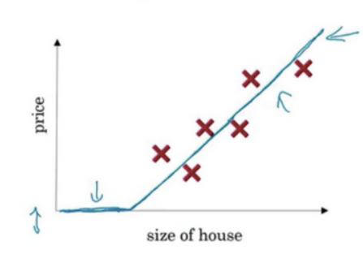
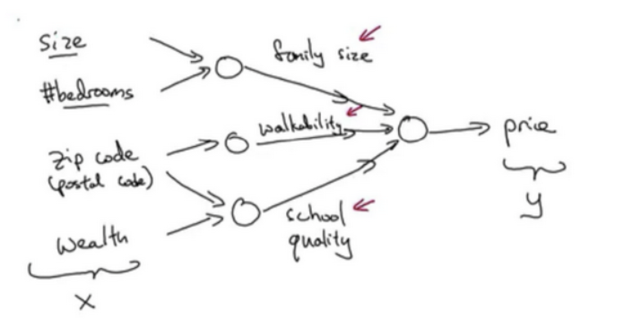
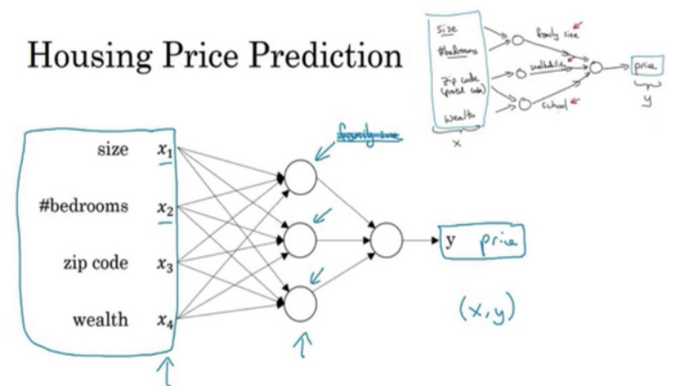

+ Relu激活函数(Rectified Linear Unit)
  
    rectify（修正）可以理解成$max(0,x)$。

    

+ 单神经元网络
  
    不管规模大小，它正是通过把这些单个神经元叠加在一起来形成。如果你把这些神经元想象成单独的乐高积木，你就通过搭积木来完成一个更大的神经网络。
  
    

    在图上每一个画的小圆圈都可以是ReLU的一部分，也就是指修正线性单元，或者其它稍微非线性的函数。基于房屋面积和卧室数量，可以估算家庭人口，基于邮编，可以估测步行化程度或者学校的质量。最后你可能会这样想，这些决定人们乐意花费多少钱。

+ 基础神经网络
    

    这里有四个输入的神经网络，这输入的特征可能是房屋的大小、卧室的数量、邮政编码和区域的富裕程度。给出这些输入的特征之后，神经网络的工作就是预测对应的价格。同时也注意到这些被叫做`隐藏单元圆圈`，在一个神经网络中，它们每个都从输入的四个特征获得自身输入，比如说，第一个结点代表家庭人口，而家庭人口仅仅取决于和特征，换句话说，在神经网络中，你决定在这个结点中想要得到什么，然后用所有的四个输入来计算想要得到的。因此，我们说输入层和中间层被紧密的连接起来了。

+ 神经网络的监督学习(Supervised Learning with Neural Networks)

    深度学习系统已经可以创造如此多的价值，通过智能的选择，哪些作为哪些作为，来针对于你当前的问题，然后拟合监督学习部分，往往是一个更大的系统，比如自动驾驶。这表明神经网络类型的轻微不同，也可以产生不同的应用。
    + 卷积神经网络(CNN,Convolutional Neural Network)
    + 循环神经网络(RNN,Recurrent Neural Network)