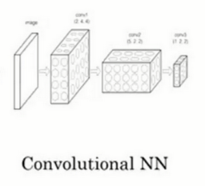
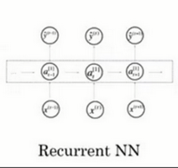
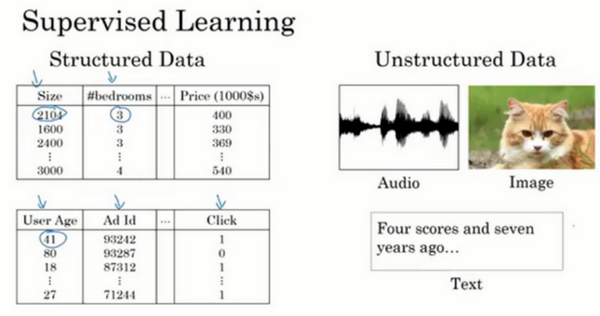
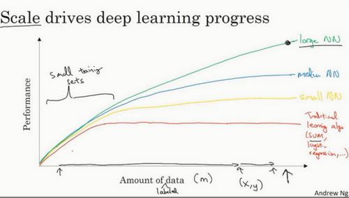
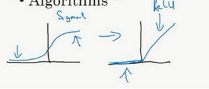

+ Relu激活函数(Rectified Linear Unit)
  
    rectify（修正）可以理解成$max(0,x)$。

    

+ 单神经元网络
  
    不管规模大小，它正是通过把这些单个神经元叠加在一起来形成。如果你把这些神经元想象成单独的乐高积木，你就通过搭积木来完成一个更大的神经网络。
  
    

    在图上每一个画的小圆圈都可以是ReLU的一部分，也就是指修正线性单元，或者其它稍微非线性的函数。基于房屋面积和卧室数量，可以估算家庭人口，基于邮编，可以估测步行化程度或者学校的质量。最后你可能会这样想，这些决定人们乐意花费多少钱。

+ 基础神经网络
    

    这里有四个输入的神经网络，这输入的特征可能是房屋的大小、卧室的数量、邮政编码和区域的富裕程度。给出这些输入的特征之后，神经网络的工作就是预测对应的价格。同时也注意到这些被叫做`隐藏单元圆圈`，在一个神经网络中，它们每个都从输入的四个特征获得自身输入，比如说，第一个结点代表家庭人口，而家庭人口仅仅取决于和特征，换句话说，在神经网络中，你决定在这个结点中想要得到什么，然后用所有的四个输入来计算想要得到的。因此，我们说输入层和中间层被紧密的连接起来了。

+ 神经网络的监督学习(Supervised Learning with Neural Networks)

    深度学习系统已经可以创造如此多的价值，通过智能的选择，哪些作为哪些作为，来针对于你当前的问题，然后拟合监督学习部分，往往是一个更大的系统，比如自动驾驶。这表明神经网络类型的轻微不同，也可以产生不同的应用。
    + 卷积神经网络(CNN,Convolutional Neural Network)
        
    + 循环神经网络(RNN,Recurrent Neural Network)
        
    + 结构化/非结构化数据

        处理非结构化数据是很难的，与结构化数据比较，让计算机理解非结构化数据很难，而人类是非常善于理解音频信号和图像等非结构化的数据的，所以也期望在深度学习中应用这种能力。

        
        + 结构化数据

            结构化数据意味着数据有基本的数据库。
        + 非结构化数据(音频/视频/文本)

            非结构化数据是指比如音频，原始音频或者你想要识别的图像或文本中的内容。这里的特征可能是图像中的像素值或文本中的单个单词。

+ 神经网络的性能

    

    从上图可以看出，最可靠的方法来在神经网络上获得更好的性能，往往就是
    + 训练一个更大的神经网络
    + 投入更多的数据(训练集)
    + 如果你没有大量的训练集，那效果会取决于你的`特征工程`能力

    性能提升的例子:激活函数的改变(sigmoid函数->Relu函数)

    

    仅仅通过将Sigmod函数转换成ReLU函数，便能够使得一个叫做梯度下降（gradient descent）的算法运行的更`快`。

    启示:通过改变算法来提高神经网络效率
    
    我们通过改变算法，使得代码运行的更快，这也使得我们能够训练规模更大的神经网络，如果你的神经网络在应用方面工作的更好、更快的计算，在提高速度方面真的有帮助，那样你就能更快地得到你的实验结果。所有这些都使得整个深度学习的研究社群变的如此繁荣，包括令人难以置信地发明新的算法和取得不间断的进步。

+ sigmod函数

sigmoid函数也叫Logistic函数，用于隐层神经元输出，取值范围为(0,1)，它可以将一个实数映射到(0,1)的区间，可以用来做二分类。在特征相差比较复杂或是相差不是特别大时效果比较好。Sigmoid作为激活函数有以下优缺点：
  + 优点：平滑、易于求导。
  + 缺点：激活函数计算量大，反向传播求误差梯度时，求导涉及除法；反向传播时，很容易就会出现梯度消失的情况，从而无法完成深层网络的训练。

