# 1. 神经网络的编程基础

## 1.1. 二分类

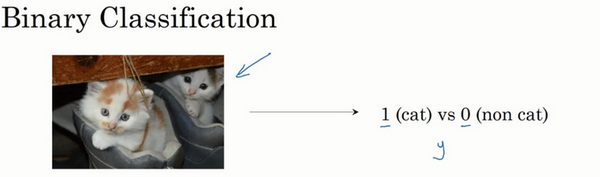

输入：一张图片，输出：y代表标签->1(cat)vs0(not cat)

**输入图像的格式**

3个通道：red/green/blue(3个n*m矩阵)

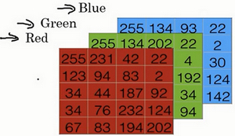

输入：图像转化为特征向量(n*1维)(由3个通道的像素值组成)

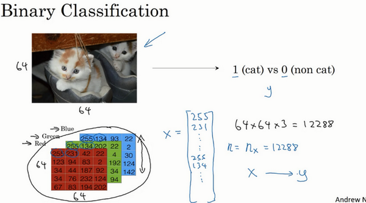

**符号定义**

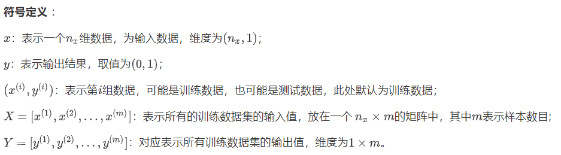

**二分类过程**

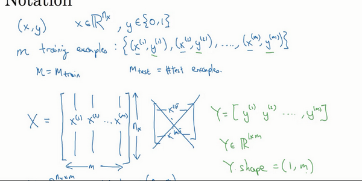

输入：训练集X(n*m维矩阵),m是输入样本的数量,每列代表一张图像  

输出：结果集Y(1*m维矩阵),每列是对应的样本的标签

*注：采用的是列存储，行存储在神经网络中不是那么适用*

## 1.2. 逻辑回归(logistic regression)

逻辑回归适合于二分类问题

已知二分类问题的输入是一个$n_x$维的特征向量X，如果用$\omega$($n_x$维向量)来表示逻辑回归的参数，也即`每个特征的权重`，令设一个参数b代表偏差

则会有$\hat{y}=\omega^Tx+b$

由于$\hat{y}$的输出可能不会介于0-1之间，所以需要真正$\hat{y}$应该是上面的线性函数作为自变量的sigmoid函数的输出值

即$\hat{y}=sigmod(\omega^Tx+b)$

逻辑回归原则：让机器学习参数$\omega$以及b，使得$\hat{y}$成为对y=1这一情况的概率一个很好的估计

**sigmod函数**

表达式

$\sigma(z)=\frac{1}{1+e^{-z}}$=>上下侧极限分别为1和0

+ 从0平滑地走向1

+ 曲线与纵轴相交的截距是0.5

*读者注*

**让参数$\omega$和参数b不分开。**

定义一个额外的特征$x_0$，并使它等于1，那么X是一个$n_x+1$维的向量，那么逻辑回归就变成了$\hat{y}=\sigma(\theta^Tx)$这样的sigmod函数。

$\omega$变成了比他多一维的$\theta$，其中$\theta_0$作为b变成了特征权重的一部分，只不过它对应的特征是一个常数1。

## 1.3. 逻辑回归的代价函数(cost function)

**why？**

通过训练代价函数来得到参数$\omega$和b

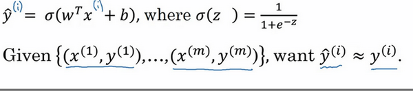

很显然，为了让逻辑回归模型通过学习找到合适的$\omega$和b,我们需要准备一个m样本的训练集作为输入。

可知,$y^{(i)}=\omega^Tx^{(i)}+b$

**损失函数(loss fucntion)**

衡量预测值和实际值的接近程度。

逻辑回归的优化目标不是*凸优化*，会找到多个局部最优解，梯度下降法很可能会找不到全局最优值。所以我们不使用普通的平方差函数。

**逻辑回顾的损失函数**

$$L(\hat{y},y)=-ylog(\hat{y})-(1-y)log(1-\hat{y})$$

当y=1时损失函数$L=-log(\hat{y})$，如果想要损失函数L尽可能得小，那么$\hat{y}$就要尽可能大，因为sigmoid函数取值，所以会无限接近于1。

当y=0时损失函数$L=-log(1-\hat{y})$，如果想要损失函数L尽可能得小，那么$\hat{y}$就要尽可能小，因为sigmoid函数取值，所以会无限接近于0。

**损失函数效果**

如果y等于1，我们就尽可能让$\hat{y}$变大，如果y等于0，我们就尽可能让$\hat{y}$变小。

**代价函数**

损失函数显然是定义在单个训练样本上的，为了衡量全部训练集的表现需要定义一个算法的**代价函数**。

算法的代价函数是对m个样本的损失函数求和然后除以m(损失均值)。

$$J(\omega,b)=\frac{1}{m}\sum_{i=1}^m(-y^{(i)}log\hat{y}^{(i)}-(1-y^{(i)})log(1-\hat{y}^{(i)}))$$

**总结**

损失函数只适用于像这样的单个训练样本，而代价函数是参数的总代价，所以在训练逻辑回归模型时候，我们需要找到合适的$\omega$和b，来让代价函数J的总代价降到最低。

## 梯度下降法(gradient descent)

通过最小化代价函数j($\omega$,b)来训练参数$\omega$和b

**形象化说明**

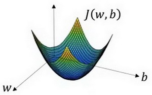

*注:实际中$\omega$可能是更高的维度,此处是1维*

曲面的高度是$J(\omega,b)$在某一点的函数值

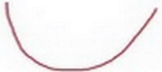

如图，代价函数（成本函数）$L(\omega,b)$是一个凸函数(convex function)，像一个大碗一样。

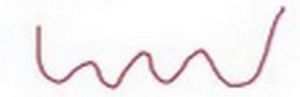

如图，这就与刚才的图有些相反，因为它是非凸的并且有很多不同的局部最小值。由于逻辑回归的代价函数（成本函数）$J(\omega,b)$特性，我们必须定义代价函数（成本函数）为凸函数,才能找到全局最优解。

1. 初始化
   
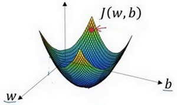
2. 朝最抖的下坡方向走一步，不断迭代

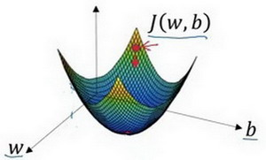
3. 直到走到全局最优解或者接近最优解的地方

**公式化说明**

*一元变量$\omega$*

z则有$\omega:=\omega-\alpha\frac{dJ(\omega)}{d\omega}$

迭代就是不断重复做如果的公式

