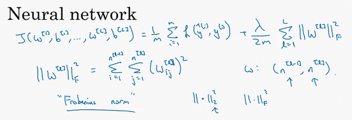

# 深度学习的实践层面

## 训练/验证/测试集（train,dev,test set）

在配置训练、验证和测试数据集的过程中做出正确决策会在很大程度上帮助大家创建高效的神经网络。训练神经网络时，我们需要做出很多决策，例如：

+ 神经网络分多少层？
+ 每层含有多少个隐藏单元？
+ 学习速率是多少？
+ 各层采用哪些激活函数？

**解决方案：通过经验+实验验证**
创建新应用的过程中，我们不可能从一开始就准确预测出这些信息和其他超级参数。实际上，应用型机器学习是一个高度迭代的过程，通常在项目启动时，我们会先有一个初步想法，比如构建一个含有特定层数，隐藏单元数量或数据集个数等等的神经网络，然后编码，并尝试运行这些代码，通过运行和测试得到该神经网络或这些配置信息的运行结果，你可能会根据输出结果重新完善自己的想法，改变策略，或者为了找到更好的神经网络不断迭代更新自己的方案。

最佳决策取决于你所拥有的数据量，计算机配置中输入特征的数量，用GPU训练还是CPU，GPU和CPU的具体配置以及其他诸多因素。

目前为止，我觉得，对于很多应用系统，即使是经验丰富的深度学习行家也不太可能一开始就预设出最匹配的超级参数，所以说，应用深度学习是一个典型的迭代过程，需要多次循环往复，才能为应用程序找到一个称心的神经网络，因此循环该过程的效率是决定项目进展速度的一个关键因素，而创建高质量的训练数据集，验证集和测试集也有助于提高循环效率。

**数据集划分**

假设这是训练数据，我用一个长方形表示，我们通常会将这些数据划分成几部分，一部分作为训练集，一部分作为简单交叉验证集，有时也称之为验证集，方便起见，我就叫它验证集（dev set），其实都是同一个概念，最后一部分则作为测试集。

接下来，我们开始对训练执行算法，通过验证集或简单交叉验证集选择最好的模型，经过充分验证，我们选定了最终模型，然后就可以在测试集上进行评估了，为了无偏评估算法的运行状况。

*小数据*

在机器学习发展的小数据量时代，常见做法是将所有数据三七分，就是人们常说的70%训练集，30%测试集，如果没有明确设置验证集，也可以按照60%训练，20%验证和20%测试集来划分。这是前几年机器学习领域普遍认可的最好的实践方法。

*大数据*

但是在大数据时代，我们现在的数据量可能是百万级别，那么验证集和测试集占数据总量的比例会趋向于变得更小。因为验证集的目的就是验证不同的算法，检验哪种算法更有效，因此，验证集要足够大才能评估，比如2个甚至10个不同算法，并迅速判断出哪种算法更有效。我们可能不需要拿出20%的数据作为验证集。

比如我们有100万条数据，那么取1万条数据便足以进行评估，找出其中表现最好的1-2种算法。同样地，根据最终选择的分类器，测试集的主要目的是正确评估分类器的性能，所以，如果拥有百万数据，我们只需要1000条数据，便足以评估单个分类器，并且准确评估该分类器的性能。假设我们有100万条数据，其中1万条作为验证集，1万条作为测试集，100万里取1万，比例是1%，即：训练集占98%，验证集和测试集各占1%。对于数据量过百万的应用，训练集可以占到99.5%，验证和测试集各占0.25%，或者验证集占0.4%，测试集占0.1%。

----
现代深度学习的另一个趋势是越来越多的人在训练和测试集分布不匹配的情况下进行训练，假设你要构建一个用户可以上传大量图片的应用程序，目的是找出并呈现所有猫咪图片，可能你的用户都是爱猫人士，训练集可能是从网上下载的猫咪图片，而验证集和测试集是用户在这个应用上上传的猫的图片，就是说，训练集可能是从网络上抓下来的图片。而验证集和测试集是用户上传的图片。结果许多网页上的猫咪图片分辨率很高，很专业，后期制作精良，而用户上传的照片可能是用手机随意拍摄的，像素低，比较模糊，这两类数据有所不同，针对这种情况，根据经验，**我建议大家要确保验证集和测试集的数据来自同一分布**，关于这个问题我也会多讲一些。因为你们要用验证集来评估不同的模型，尽可能地优化性能。如果验证集和测试集来自同一个分布就会很好。

**数据的来源**

但由于深度学习算法需要大量的训练数据，为了获取更大规模的训练数据集，我们可以采用当前流行的各种创意策略，例如，网页抓取，代价就是训练集数据与验证集和测试集数据有可能不是来自同一分布。但只要遵循这个经验法则，你就会发现机器学习算法会变得更快。我会在后面的课程中更加详细地解释这条经验法则。

最后一点，就算没有测试集也不要紧，测试集的目的是对最终所选定的神经网络系统做出无偏估计，如果不需要无偏估计，也可以不设置测试集。所以如果只有验证集，没有测试集，我们要做的就是，在训练集上训练，尝试不同的模型框架，在验证集上评估这些模型，然后迭代并选出适用的模型。因为**验证集中已经涵盖测试集数据**，其不再提供无偏性能评估。当然，如果你不需要无偏估计，那就再好不过了。

*注：不使用测试集可能无法说明模型具有较强的泛化能力，即面对其他样本误差较小*

## 偏差/方差（bias/variance）

如果给这个数据集拟合一条直线，可能得到一个逻辑回归拟合，但它并不能很好地拟合该数据，这是高偏差（high bias）的情况，我们称为“欠拟合”（underfitting）。（图1）

相反的如果我们拟合一个非常复杂的分类器，比如深度神经网络或含有隐藏单元的神经网络，可能就非常适用于这个数据集，但是这看起来也不是一种很好的拟合方式分类器方差较高（high variance），数据过度拟合（overfitting）（图3）

在两者之间，可能还有一些像图中这样的，复杂程度适中，数据拟合适度的分类器，这个数据拟合看起来更加合理，我们称之为“适度拟合”（just right）是介于过度拟合和欠拟合中间的一类。（图2）

---

**具体解释方差与偏差在训练过程中的体现**

我们沿用猫咪图片分类这个例子，左边一张是猫咪图片，右边一张不是。理解偏差和方差的两个关键数据是训练集误差（Train set error）和验证集误差（Dev set error），为了方便论证，假设我们可以辨别图片中的小猫，我们用肉眼识别几乎是不会出错的。

假定训练集误差是1%，为了方便论证，假定验证集误差是11%，可以看出训练集设置得非常好，而验证集设置相对较差，我们可能过度拟合了训练集，在某种程度上，验证集并没有充分利用交叉验证集的作用，像这种情况，我们称之为“高方差”。

通过查看训练集误差和验证集误差，我们便可以诊断算法是否具有高方差。也就是说衡量训练集和验证集误差就可以得出不同结论。

假设训练集误差是15%，我们把训练集误差写在首行，验证集误差是16%，假设该案例中人的错误率几乎为0%，人们浏览这些图片，分辨出是不是猫。算法并没有在训练集中得到很好训练，如果训练数据的拟合度不高，就是数据欠拟合，就可以说这种算法偏差比较高。相反，它对于验证集产生的结果却是合理的，验证集中的错误率只比训练集的多了1%，所以这种算法偏差高，因为它甚至不能拟合训练集，这与上一张幻灯片最左边的图片相似。

再举一个例子，训练集误差是15%，偏差相当高，但是，验证集的评估结果更糟糕，错误率达到30%，在这种情况下，我会认为这种算法偏差高，因为它在训练集上结果不理想，而且方差也很高，这是**方差偏差都很糟糕的情况**。

再看最后一个例子，训练集误差是0.5%，验证集误差是1%，用户看到这样的结果会很开心，猫咪分类器只有1%的错误率，偏差和方差都很低。

*注：最优误差，即贝叶斯误差，有可能对于某些训练集，就是15%，而不是说所有的准确率都必须达到99%甚至更高。*

当所有分类器都不适用时，如何分析偏差和方差呢？比如，图片很模糊，即使是人眼，或者没有系统可以准确无误地识别图片，在这种情况下，最优误差会更高，那么分析过程就要做些改变了，我们暂时先不讨论这些细微差别，重点是通过查看训练集误差，我们可以判断数据拟合情况，至少对于训练数据是这样，可以判断是否有偏差问题，然后查看错误率有多高。当完成训练集训练，开始使用验证集验证时，我们可以判断方差是否过高，从训练集到验证集的这个过程中，我们可以判断方差是否过高。

*注：采用曲线函数或二次元函数会产生高方差，（训练集错误率很低而验证集错误率很高）因为它曲线灵活性太高以致拟合了这两个错误样本和中间这些活跃数据。*

## 机器学习基础

下图就是我在训练神经网络用到的基本方法：（尝试这些方法，可能有用，可能没用）

有两点需要大家注意：

第一点，高偏差和高方差是两种不同的情况，我们后续要尝试的方法也可能完全不同，我通常会用训练验证集来诊断算法是否存在偏差或方差问题，然后根据结果选择尝试部分方法。举个例子，如果算法存在高偏差问题，准备更多训练数据其实也没什么用处，至少这不是更有效的方法，所以大家要清楚存在的问题是偏差还是方差，还是两者都有问题，明确这一点有助于我们选择出最有效的方法。

第二点，在机器学习的初期阶段，关于所谓的偏差方差权衡的讨论屡见不鲜，原因是我们能尝试的方法有很多。可以增加偏差，减少方差，也可以减少偏差，增加方差，但是在深度学习的早期阶段，我们没有太多工具可以做到只减少偏差或方差却不影响到另一方。但在当前的深度学习和大数据时代，只要持续训练一个更大的网络，只要准备了更多数据，那么也并非只有这两种情况，我们假定是这样，那么，只要正则适度，通常构建一个更大的网络便可以，在不影响方差的同时减少偏差，而采用更多数据通常可以在不过多影响偏差的同时减少方差。这两步实际要做的工作是：训练网络，选择网络或者准备更多数据，现在我们有工具可以做到在减少偏差或方差的同时，不对另一方产生过多不良影响。我觉得这就是深度学习对监督式学习大有裨益的一个重要原因，也是我们不用太过关注如何平衡偏差和方差的一个重要原因，但有时我们有很多选择，减少偏差或方差而不增加另一方。最终，我们会得到一个非常规范化的网络。从下节课开始，我们将讲解正则化，训练一个更大的网络几乎没有任何负面影响，而训练一个大型神经网络的主要代价也只是计算时间，前提是网络是比较规范化的。

## 正则化

深度学习可能存在过拟合问题-高方差（训练集误差低，验证集误差高）

**解决方法**

+ 正则化
+ 准备更多的训练数据    

准备更多的数据，这是非常可靠的方法，但你可能无法时时刻刻准备足够多的训练数据或者获取更多数据的成本很高，但正则化通常有助于避免过拟合或减少你的网络误差。

**正则化的原理**

对于逻辑回归来说，我们要求成本函数J的最小值，其中包含有w和b两个参数，其中w是一个多维度参数矢量，b则是一个实数。若要在逻辑回归函数中加入正则化，只需要添加参数$\lambda$。

**L2正则化**

如上图所示。代价函数加上$\frac{\lambda}{2m}$乘以w范数的平方(即$w^Tw$,可理解为到原点距离的平方)，此方法称为**L2正则化**。

**为什么只正则化参数w？为什么不再加上参数b呢？**

你可以这么做，只是我习惯省略不写，因为w通常是一个高维参数矢量，已经可以表达高偏差问题，w可能包含有很多参数，我们不可能拟合所有参数，而b只是单个数字，所以w几乎涵盖所有参数，而不是b，如果加了参数b，其实也没太大影响，因为b只是众多参数中的一个，所以我通常省略不计，如果你想加上这个参数，完全没问题。

**L1正则化**

$L2$正则化是最常见的正则化类型，你们可能听说过$L1$正则化，$L1$正则化，加的不是$L2$范数，而是正则项$\frac{\lambda}{m}$乘以$\sum_{j= 1}^{n_{x}}{|w|}$，$\sum_{j =1}^{n_{x}}{|w|}$也被称为参数$w$向量的$L1$范数，无论分母是$m$还是$2m$，它都是一个比例常量。

**L1/L2正则化的区别**

如果用的是L1正则化，最终会是稀疏的，也就是说W向量中有很多0，有人说这样有利于压缩模型，因为集合中参数均为0，存储模型所占用的内存更少。实际上，虽然L1正则化使模型变得稀疏，却没有降低太多存储内存，所以我认为这并不是L1正则化的目的，至少不是为了压缩模型，人们在训练网络时，越来越倾向于使用L2正则化。

我们来看最后一个细节，$\lambda$是正则化参数，我们通常使用验证集或交叉验证集来配置这个参数，尝试各种各样的数据，寻找最好的参数，我们要考虑训练集之间的权衡，把参数设置为较小值，这样可以避免过拟合，所以$\lambda$是另外一个需要调整的超参数。

**如何在神经网络中实现L2正则化？**

神经网络含有一个成本函数，该函数包含$W^{[1]}$，$b^{[1]}$到$W^{[l]}$，$b^{[l]}$所有参数，字母$L$是神经网络所含的层数，因此成本函数等于$m$个训练样本损失函数的总和乘以$\frac{1}{m}$，正则项为$\frac{\lambda }{2m}{{\sum\nolimits_{1}^{L}{| {{W}^{[l]}}|}}^{2}}$，我们称${||W^{\left[l\right]}||}^{2}$为范数平方，这个矩阵范数${||W^{\left[l\right]}||}^{2}$（即平方范数），被定义为矩阵中所有元素的平方求和。

我们看下求和公式的具体参数，第一个求和符号其值$i$从1到$n^{[l - 1]}$，第二个其$J$值从1到$n^{[l]}$，因为$W$是一个$n^{[l]}\times n^{[l-1]}$的多维矩阵，$n^{[l]}$表示$l$ 层单元的数量，$n^{[l-1]}$表示第$l-1$层隐藏单元的数量。这就是矩阵L2范数。

你必须尝试很多正则化参数$\Lambda$的值，这也导致搜索大量值的计算代价太高。

**如何使用该范数实现梯度下降？**

*注：下图给的某一层的权重矩阵更新*

如上图所示。向后传播会给出原来的J对w的偏导数$dW$。现在我们要做的就是给$dW$加上这一项$\frac {\lambda}{m}W^{[l]}$，然后计算这个更新项，使用新定义的$dW^{[l]}$，它的定义含有相关参数代价函数导数和，以及最后添加的额外正则项，这也是$L2$正则化有时被称为“权重衰减”的原因（权重比原来下降更快）。

*注:可以看出分母上的2只是为了求导方便。*

**为什么正则化有利于预防过拟合？**

预防过拟合，也就是减小方差。

直观上理解就是如果正则化$\Lambda$设置得足够大，权重矩阵$W$被设置为接近于0的值，直观理解就是把多隐藏单元的权重设为0，于是基本上消除了这些隐藏单元的许多影响。如果是这种情况，这个被大大简化了的神经网络会变成一个很小的网络，小到如同一个逻辑回归单元，可是深度却很大，它会使这个网络从过度拟合的状态更接近左图的高偏差状态。

但是$\lambda$会存在一个中间值，于是会有一个接近“Just Right”的中间状态。

直观理解就是$\lambda$增加到足够大，$W$会接近于0，实际上是不会发生这种情况的，我们尝试消除或至少减少许多隐藏单元的影响，最终这个网络会变得更简单，这个神经网络越来越接近逻辑回归，我们直觉上认为大量隐藏单元被完全消除了，其实不然，实际上是该神经网络的所有隐藏单元依然存在，但是它们的影响变得更小了。神经网络变得更简单了，貌似这样更不容易发生过拟合，因此我不确定这个直觉经验是否有用，不过在编程中执行正则化时，你实际看到一些方差减少的结果。

## dropout（随机失活）正则化

假设你在训练上图这样的神经网络，它存在过拟合，这就是dropout所要处理的，我们复制这个神经网络，dropout会遍历网络的每一层，并设置消除神经网络中节点的概率。假设网络中的每一层，每个节点都以抛硬币的方式设置概率，每个节点得以保留和消除的概率都是0.5，设置完节点概率，我们会消除一些节点，然后删除掉从该节点进出的连线，最后得到一个节点更少，规模更小的网络，然后用backprop方法进行训练。

*注：随机简化网络。*

## 理解dropout

Dropout可以随机删除网络中的神经单元，他为什么可以通过正则化发挥如此大的作用呢？

实施dropout的另一个细节是，这是一个拥有三个输入特征的网络，其中一个要选择的参数是keep-prob，它代表每一层上保留单元的概率。所以不同层的keep-prob也可以变化。第一层，矩阵$W^{[1]}$是7×3，第二个权重矩阵$W^{[2]}$是7×7，第三个权重矩阵$W^{[3]}$是3×7，以此类推，$W^{[2]}$是最大的权重矩阵，因为$W^{[2]}$拥有最大参数集，即7×7，为了预防矩阵的过拟合，对于这一层，我认为这是第二层，它的keep-prob值应该相对较低，假设是0.5。对于其它层，过拟合的程度可能没那么严重，它们的keep-prob值可能高一些，可能是0.7，这里是0.7。如果在某一层，我们不必担心其过拟合的问题，那么keep-prob可以为1，为了表达清除，我用紫色线笔把它们圈出来，每层keep-prob的值可能不同。

**dropout常用于cv领域**
计算视觉中的输入量非常大，输入太多像素，以至于没有足够的数据，所以dropout在计算机视觉中应用得比较频繁，有些计算机视觉研究人员非常喜欢用它，几乎成了默认的选择，但要牢记一点，dropout是一种正则化方法，它有助于预防过拟合，因此除非算法过拟合，不然我是不会使用dropout的，所以它在其它领域应用得比较少，主要存在于计算机视觉领域，因为我们通常没有足够的数据，所以一直存在过拟合，这就是有些计算机视觉研究人员如此钟情于dropout函数的原因。直观上我认为不能概括其它学科。

**缺点**

dropout一大缺点就是代价函数不再被明确定义，每次迭代，都会随机移除一些节点，如果再三检查梯度下降的性能，实际上是很难进行复查的。定义明确的代价函数每次迭代后都会下降，因为我们所优化的代价函数实际上并没有明确定义，或者说在某种程度上很难计算，所以我们失去了调试工具来绘制这样的图片。

## 其他正则化方法

+ 数据扩增（数据集正则化）

翻转图片、裁剪图片、放大图片、加噪声等行为生成*新*数据

+ early stopping

还有另外一种常用的方法叫作early stopping，运行梯度下降时，我们可以绘制训练误差，或只绘制代价函数J的优化过程，在训练集上用0-1记录分类误差**次数**。呈单调下降趋势，如图。

early stopping的作用是，你会说，神经网络已经在这个迭代过程中表现得很好了，我们在此停止训练吧，得到验证集误差，它是怎么发挥作用的？

arly stopping要做就是在中间点停止迭代过程，我们得到一个w值中等大小的弗罗贝尼乌斯范数，与L2正则化相似，选择参数w范数较小的神经网络，但愿你的神经网络过度拟合不严重。

## 归一化输入

训练神经网络，其中一个加速训练的方法就是归一化输入。假设一个训练集有两个特征，输入特征为2维，归一化需要两个步骤：

1. 零均值
2. 归一化方差

第一步是零均值化，$\mu = \frac{1}{m}\sum_{i =1}^{m}x^{(i)}$，它是一个向量，$x$等于每个训练数据 $x$减去$\mu$，意思是移动训练集，直到它完成零均值化。

第二步是归一化方差，注意特征$x_{1}$的方差比特征$x_{2}$的方差要大得多，我们要做的是给$\sigma$赋值，$\sigma^{2}= \frac{1}{m}\sum_{i =1}^{m}{({x^{(i)})}^{2}}$，这是节点$y$ 的平方，$\sigma^{2}$是一个向量，它的每个特征都有方差，注意，我们已经完成零值均化，$({x^{(i)})}^{2}$元素$y^{2}$就是方差，我们把所有数据除以向量$\sigma^{2}$，最后变成上图形式。

**为什么要归一化输入特征？**

然而如果你归一化特征，代价函数平均起来看更对称，如果你在上图这样的代价函数上运行梯度下降法，你必须使用一个非常小的学习率。因为如果是在这个位置，梯度下降法可能需要多次迭代过程，直到最后找到最小值。但如果函数是一个更圆的球形轮廓，那么不论从哪个位置开始，梯度下降法都能够更直接地找到最小值，你可以在梯度下降法中使用较大步长，而不需要像在左图中那样反复执行。

当然，实际上w是一个高维向量，因此用二维绘制w并不能正确地传达并直观理解，但总地直观理解是代价函数会更圆一些，而且更容易优化，前提是特征都在相似范围内，而不是从1到1000，0到1的范围，而是在-1到1范围内或相似偏差，这使得代价函数优化起来更简单快速。

实际上如果假设特征范围在0-1之间，的范围在-1到1之间，范围在1-2之间，它们是相似范围，所以会表现得很好。

当它们在非常不同的取值范围内，如其中一个从1到1000，另一个从0到1，这对优化算法非常不利。但是仅将它们设置为均化零值，假设方差为1，就像上一张幻灯片里设定的那样，确保所有特征都在相似范围内，通常可以帮助学习算法运行得更快。

所以如果输入特征$x_1$处于不同范围内，$x_2$可能有些特征值从0到1，有些从1到1000，那么归一化特征值就非常重要了。如果特征值处于相似范围内，那么归一化就不是很重要了。执行这类归一化并不会产生什么危害，我通常会做归一化处理，虽然我不确定它能否提高训练或算法速度。

## 梯度消失/梯度爆炸(Vanishing/exploding gradients)

我希望你得到的直观理解是，权重$W​$只比1略大一点，或者说只是比单位矩阵大一点，深度神经网络的激活函数将爆炸式增长，如果$W​$比1略小一点，可能是$\begin{bmatrix}0.9 & 0 \ 0 & 0.9 \ \end{bmatrix}​$,在深度神经网络中，激活函数将以指数级递减，虽然我只是讨论了激活函数以与$L$相关的指数级数增长或下降，它也适用于与层数$L$相关的导数或梯度函数，也是呈指数级增长或呈指数递减。

## 神经网络的权重初始化

**梯度消失和梯度爆炸问题的解决方案**

设置一个合理的初始权重矩阵

在随机初始化的基础上乘以**系数**

+ tanh激活函数

    $\text{np.}\text{sqrt}(\frac{2}{n^{[l-1]}})$

+ ReLu激活函数

    $\text{np.}\text{sqrt}(\frac{1}{n^{[l-1]}})$

希望你设置的权重矩阵既不会增长过快，也不会太快下降到0，从而训练出一个权重或梯度不会增长或消失过快的深度网络。我们在训练深度网络时，这也是一个加快训练速度的技巧。

## 梯度的数值逼近

所以在执行梯度检验时，我们使用双边误差，即$\frac{f\left(\theta + \varepsilon \right) - f(\theta -\varepsilon)}{2\varepsilon}$，而不使用单边公差，因为它不够准确。

## 梯度检验

首先，我们要清楚$J$是超参数$\theta$的一个函数，你也可以将J函数展开为$J(\theta_{1},\theta_{2},\theta_{3},\ldots\ldots)$，不论超级参数向量$\theta$的维度是多少，为了实施梯度检验，你要做的就是循环执行，从而对每个$i$也就是对每个$\theta$组成元素计算$d\theta_{\text{approx}}[i]$的值，我使用双边误差，也就是

$d\theta_{\text{approx}}\left[i \right] = \frac{J\left( \theta_{1},\theta_{2},\ldots\theta_{i} + \varepsilon,\ldots \right) - J\left( \theta_{1},\theta_{2},\ldots\theta_{i} - \varepsilon,\ldots \right)}{2\varepsilon}$

只对$\theta_{i}​$增加$\varepsilon​$，其它项保持不变，因为我们使用的是双边误差，对另一边做同样的操作，只不过是减去$\varepsilon​$，$\theta​$其它项全都保持不变。

从上节课中我们了解到这个值（$d\theta_{\text{approx}}\left[i \right]$）应该逼近$d\theta\left[i \right]$=$\frac{\partial J}{\partial\theta_{i}}$，$d\theta\left[i \right]$是代价函数的偏导数，然后你需要对i的每个值都执行这个运算，最后得到两个向量，得到$d\theta$的逼近值$d\theta_{\text{approx}}$，它与$d\theta$具有相同维度，它们两个与$\theta$具有相同维度，你要做的就是验证这些向量是否彼此接近。

具体来说，如何定义两个向量是否真的接近彼此？我一般做下列运算，计算这两个向量的距离，$d\theta_{\text{approx}}\left[i \right] - d\theta[i]$的欧几里得范数，注意这里（${||d\theta_{\text{approx}} -d\theta||}_{2}$）没有平方，它是误差平方之和，然后求平方根，得到欧式距离，然后用向量长度归一化，使用向量长度的欧几里得范数。分母只是用于预防这些向量太小或太大，分母使得这个方程式变成比率，我们实际执行这个方程式，$\varepsilon$可能为$10^{-7}$，使用这个取值范围内的$\varepsilon$，如果你发现计算方程式得到的值为$10^{-7}$或更小，这就很好，这就意味着导数逼近很有可能是正确的，它的值非常小。

如果它的值在$10^{-5}$范围内，我就要小心了，也许这个值没问题，但我会再次检查这个向量的所有项，确保没有一项误差过大，可能这里有bug。

如果左边这个方程式结果是$10^{-3}$，我就会担心是否存在bug，计算结果应该比$10^{- 3}$小很多，如果比$10^{-3}$大很多，我就会很担心，担心是否存在bug。这时应该仔细检查所有$\theta$项，看是否有一个具体的$i$值，使得$d\theta_{\text{approx}}\left[i \right]$与$ d\theta[i]$大不相同，并用它来追踪一些求导计算是否正确，经过一些调试，最终结果会是这种非常小的值（$10^{-7}$），那么，你的实施可能是正确的。

## 梯度检验的注意事项

**梯度检验不能和dropout同时进行**

**不要在训练时进行，只用来进行检验**

