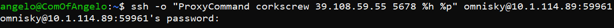
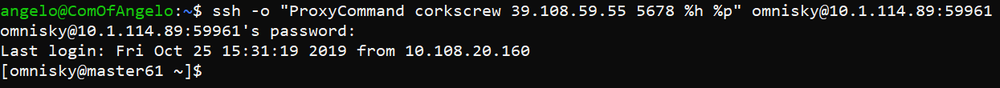
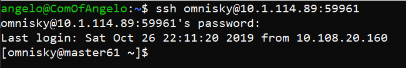
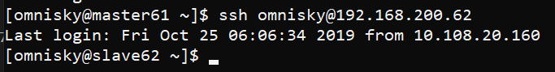

### 连接北理Flink集群
||外部ip|外部端口|
|---|---|---|
|代理服务器|39.108.59.55|5678|
|Flink Master结点|10.1.114.89|59961|

|服务器|内部ip|外部端口|内部端口|
|---|---|---|---|
|Master61|192.168.200.61|59961|22|
|slave62|192.168.200.62|59962|22|
|slave63|192.168.200.63|59963|22|
|slave64|192.168.200.64|59964|22|
|slave51|192.168.200.51|59951|22|
|slave52|192.168.200.52|59952|22|
|slave53|192.168.200.53|59953|22|

|服务|内部ip|内部端口|外部ip|外部端口|
|---|---|---|---|---|
|Hadoop WebUI|192.168.200.61|50070|10.1.114.89|59070|
|Flink WebUI|192.168.200.61|8081|10.1.114.89|59081|
|Unifi Controller|192.168.200.61|8443|10.1.114.89|59443|

### 外部连接Master

+ 方式1
    1. 在终端输入ssh指令进行连接
    >
        ssh -o "ProxyCommand corkscrew 39.108.59.55 5678 %h %p" omnisky@10.1.114.89:59961
    

    2. 输入服务器密码: linux123 即可登陆成功
    >
    

+ 方式2
    1. 修改ssh配置文件设置代理
    > 
        vim ~/.ssh/config
    写入
    >
        Host *
        ProxyCommand corkscrew 39.108.59.55 5678 %h %p
    2. 直接使用ssh连接
    >   
        ssh omnisky@10.1.114.89:59961
    3. 输入服务器密码: linux123 即可登陆成功
    >
    

### 内部连接slave

在连接Master之后，直接在Master里用ssh内部连接slave

例如连接slave62,输入如下指令
>
    ssh omnisky@192.168.200.62
如下所示:

